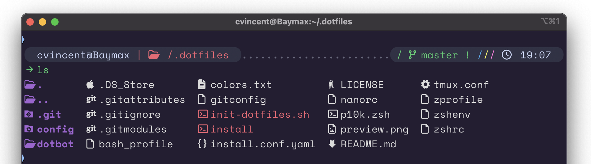

## About this project

Finally decided since I've been using terminal so much it was time to really invest in it; and that investment meant backing it all up and syncing it across a few personal and professional devices.

My device setup scripts are stored in seperate repos since I'm still in my infancy of programming. So I haven't quite mastered the skill of typing it all in together. There's the repo for setting up my macbook and one for setting up my little enviroment I'm using to lab while learning Ansible/NetOps

## How are the "dotfiles" managed

This project really finally came to fruition when I came across [DotBot](https://github.com/anishathalye/dotbot). I have previously used [Mackup](https://github.com/lra/mackup) to back up my configs on my Mac, but since I had them stored on iCloud I never got Mackup really running on Linux.

## Installation

It's as simple as cloning this repo into "~/.dotfiles" and running "./install".

### OS X Notes

You need to have [XCode](https://developer.apple.com/downloads/index.action?=xcode) or, at the very minimum, the [XCode Command Line Tools](https://developer.apple.com/downloads/index.action?=command%20line%20tools), which are available as a much smaller download.

The easiest way to install the XCode Command Line Tools in OSX 10.9+ is to open up a terminal, type `xcode-select --install` and [follow the prompts](http://osxdaily.com/2014/02/12/install-command-line-tools-mac-os-x/).

